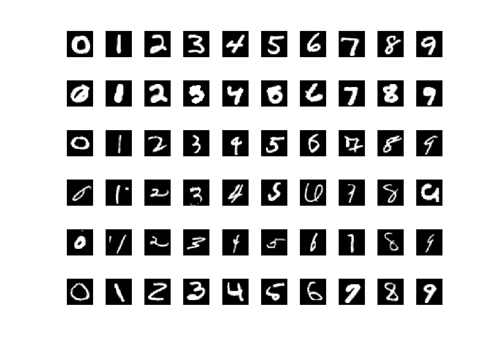

# Stein Density Ratio Estimation (SDRE) and Its Applications

### Reference: 
[*Song Liu, Takafumi Kanamori, Wittawat Jitkrittum, Yu Chen, Fisher Efficient Inference of Intractable Models, E-print: arXiv:1805.07454,  To appear NeurIPS2019, 2019*](https://arxiv.org/abs/1805.07454),

[Slides](./slides.pdf)

### Dependency on the `kernel-gof` package
If you want to run the neural network demo, you need to install [`kernel-gof`](https://github.com/wittawatj/kernel-gof) package. 

### Install the `sdre` package

If you plan to modify our code (very likely, you will want to do so), it is best to install by:

1. Clone this repository 
2. `cd` to the folder that you get, and install our package by (notice the dot at the end)

        pip install -e .

There an alternative way to install without cloning. But we do not recommend at
this point since the code requires direct modification at this point.


Once installed, you should be able to do `import sdre` in a Python shell without any error.

### To run test Stein density ratio estimation:

```bash
python script/DRE/demo.py
```

```
0
1
2
0 delta: [-0.00056058  0.00018254 -0.00041193]
100 delta: [-0.05309547  0.01852391 -0.03606012]
200 delta: [-0.09931757  0.03469031 -0.06197491]
...

```


### Estimating density ratio parameters using `sdre.estimators.primal`
```python
delta_pri = primal(logpBar, f, XData, eta = .001, max_iter=50000)
```

### Estimating density ratio parameters using of `sdre.estimators.dual`
```python
delta_dua, dual_theta, LL, TfXData = dual(logpBar, f, XData)
```

### To reproduce our MNIST experiments, please run
```bash
python sdre/trainnn.py
```
```bash
python examples/nn_MNIST/demo_NN.py
python examples/nn_MNIST/demo_NN_KSD.py
python examples/nn_MNIST/demo_NN_NCE.py
```
Then, in MATLAB, run
```MATLAB
examples/nn_MNIST/plotMNIST
```
You should see


### Folder Structure: 
- **sdre**: the provided Python package. 
- **script/DRE**: Stein Density Ratio Estimation
- **script/Inference**: Model Inference using SDRE
- README: this file